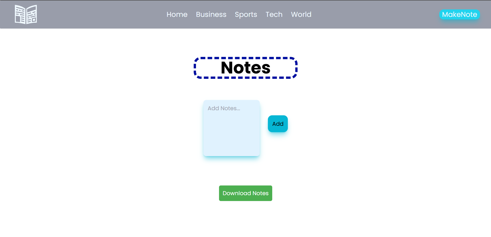

# 🗞️ The News Scraper

**Your one-stop destination for aggregated Indian news headlines**  
A multi-source news scraping web app that fetches top headlines from major platforms like *Hindustan Times*, *Indian Express*, and *News 18*, etc making news consumption faster and easier.

---

## 🚀 Features

- 🔍 Scrapes headlines from multiple trusted news sources
- ⚡ Fast and dynamic content loading
- 🎯 Clean and user-friendly UI
- 📁 Separate frontend and backend architecture
- 🧠 Built using Puppeteer for precise data scraping

---

## 📸 Screenshots

### Homepage

### Notes Making

---

## 🛠️ Tech Stack

### Frontend
- React
- Tailwind CSS
- JavaScript

### Backend
- Node.js
- Express.js
- Puppeteer

---

